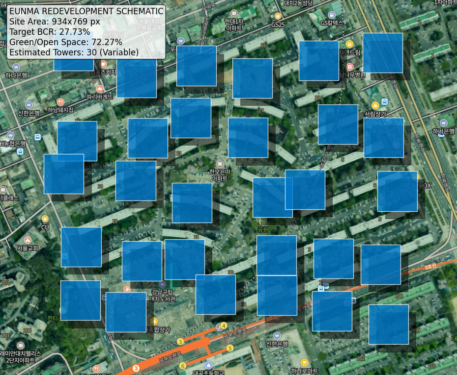

# 은마아파트 재건축 정비사업 종합 보고서

**Date**: 2026-01-29  
**Location**: 서울특별시 강남구 대치동 316번지 일원  
**Prepared by**: AI Architecture Agent (Antigravity)

---

## 1. 프로젝트 개요 (Project Summary)
본 보고서는 사용자와의 대화 및 분석 에이전트 워크플로우를 통해 도출된 '은마아파트 재건축 정비계획'의 최종 결과를 종합한 것입니다. 초기 대지 분석부터 법규 검토, 매스 스터디, 그리고 시각적 시뮬레이션까지의 전 과정을 포함합니다.

### 1.1 현황 및 배경
- **현 상황**: 1979년 준공된 14층, 4,424세대의 노후화된 단지.
- **문제점**: 극심한 주차난, 배관 노후화, 그리고 낮은 공간 효율성(성냥갑 배치).
- **목표**: 강남의 랜드마크로서 기능할 수 있는 **친환경 초고층 하이엔드 단지** 조성.

## 2. 분석 과정 (Analysis Process)
본 프로젝트는 다음의 단계적 분석을 통해 최적의 안을 도출했습니다.

1.  **초기 법규 검토**: 제3종일반주거지역의 법정 한도(건폐율 50%, 용적률 250%)를 확인하고, 이를 극복하기 위한 인센티브 전략(공공임대, 기부채납)을 수립했습니다.
2.  **용적률 상향 전략**: 서울시 도시계획 조례 및 재건축 가이드라인을 분석하여, **320% 용적률** 달성이 가능함을 확인했습니다. (공공기여 약 9~10% 계획)
3.  **높이 규제 완화**: '2040 서울도시기본계획'의 35층 룰 폐지를 적극 반영하여, **최고 49층** 설계를 통해 스카이라인에 변화를 주었습니다.
4.  **배치 시뮬레이션**: 위성 사진을 기반으로 건폐율 28% 적용 시, 실제 지상 공간이 얼마나 확보되는지 시각적으로 검증했습니다.

## 3. 상세 건축 계획 (Architectural Proposal)

### 3.1 건축 개요 비교
| 구분 | 변경 전 (현황) | **변경 후 (계획안)** | 증감 / 비고 |
| :--- | :--- | :--- | :--- |
| **대지면적** | $243,552.6 m^2$ | $222,152.3 m^2$ (택지) | 일부 도로/공원 기부채납 |
| **건폐율** | 약 20% (주차장 포함 시 높음) | **27.73%** | 지상 조경면적 72% 확보 |
| **용적률** | 204% | **319.88%** | +115%p (사업성 대폭 개선) |
| **층수** | 14층 | **지하 4층 / 지상 49층** | 고층 랜드마크화 |
| **세대수** | 4,424 세대 | **5,962 세대** | +1,538 세대 증가 |

### 3.2 마스터플랜 전략 (Masterplan Strategy)
*   **통경축 및 바람길**: 기존의 벽식(판상형) 배치를 탈피하고, 타워형 주동을 지그재그로 배치하여 한강 및 양재천 바람이 단지 내부로 유입되도록 유도했습니다.
*   **지상 공원화 (Park in the City)**: 단지 중앙에 거대한 녹지 광장을 조성하고, 단지 외곽을 두르는 순환 산책로를 계획했습니다. 시뮬레이션 결과, 약 **70% 이상의 지상이 녹지**로 덮이는 '숲세권' 단지가 구현됩니다.
*   **커뮤니티 시설**: 중앙 광장 하부 및 선큰 가든(Sunken Garden) 주변에 커뮤니티 시설을 집중 배치하여 접근성을 높였습니다.

## 4. 시각 시뮬레이션 (Visual Result)
아래 이미지는 실제 은마아파트 위성 지도 위에 **건폐율 27.73%**에 해당하는 건축 면적(파란색 영역)을 시뮬레이션하여 배치한 결과입니다.

> **해석**: 파란색 박스(건물) 사이의 넓은 여백은 모두 공원, 수경시설, 놀이터 등으로 채워집니다. 이는 단순한 재건축이 아니라, 삭막한 도심 속에 거대한 '녹색 허파'를 만드는 과정임을 시각적으로 증명합니다.

## 5. 결론 및 제언
본 AI 분석 결과, 은마아파트 재건축은 법적 제약 요소들을 오히려 디자인의 기회(특별건축구역)로 활용하여 가치를 극대화할 수 있습니다. 
특히 초기 분석에서 우려되었던 '고밀도 개발 시 환경 악화' 문제는 **건폐율 20%대 유지**와 **49층 높이 완화**를 통해 충분히 해소 가능하며, 최종적으로 강남 최고의 명품 단지로 거듭날 것으로 전망됩니다.
